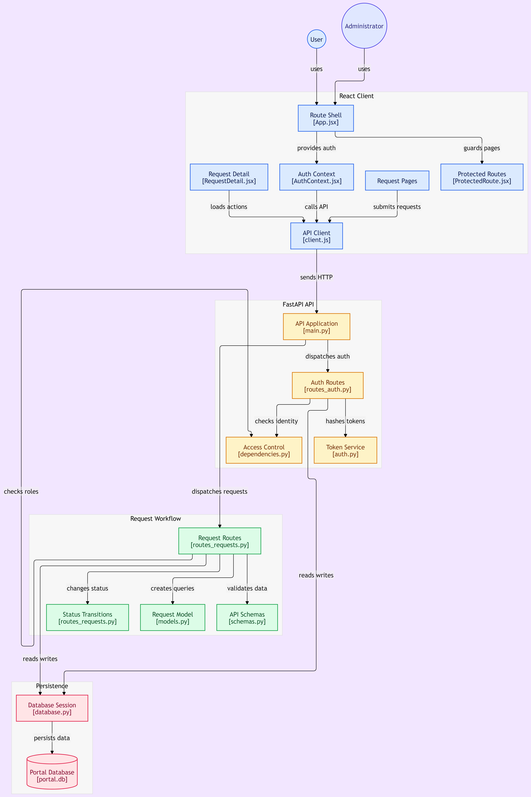

# Portal Application

A full-stack portal application built with a **React frontend** and **FastAPI backend**, providing authentication, role-based access control, request management, and database persistence.

The application supports two main roles:

- **User** – Can access protected pages and submit/manage requests.
- **Administrator** – Has administrative access and can manage requests and system-level operations.

---

## 🏗️ System Architecture

The application follows a layered architecture consisting of:

1. React Client
2. FastAPI API
3. Authentication & Authorization
4. Request Workflow
5. Database Persistence

### Architecture Diagram

---

## 🚀 Technology Stack

### Frontend

- React
- JavaScript
- React Router
- Context API
- HTTP/REST API

### Backend

- Python
- FastAPI
- Pydantic
- Authentication Routes
- Role-Based Access Control

### Database

- SQLite / Portal Database
- Database Session Management

### Architecture

- REST API
- Token-Based Authentication
- Protected Routes
- Role-Based Authorization
- Request Workflow

---

## 📁 Project Structure
cruuently not there... 
